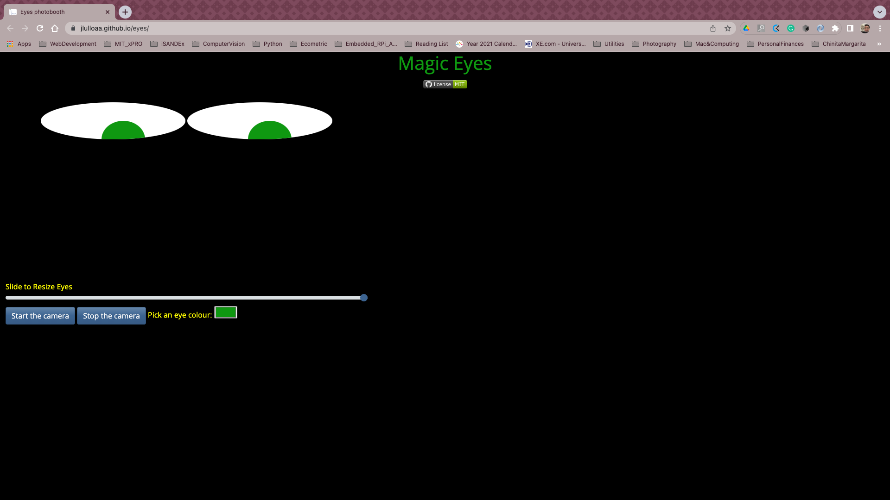
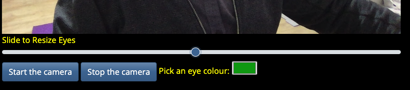

<h1 align="center">
  Magic Eyes
   
</h1>
<h4 align="center">Interacting with the DOM</h4>

  
  
  
  

  <a href="#description">Description</a> •
  <a href="#how-to-run">How To Run</a> •
  <a href="#roadmap-of-future-improvements">What's next?</a> •
  <a href="#contributing">Contributing</a> •
  <a href="#credits">Credits</a> •
  <a href="#license-information">License</a>

# :eyes: Description
Magic Eyes is an excercise to further understand how to communicate with the [DOM](https://developer.mozilla.org/en-US/docs/Web/API/Document_Object_Model) by interpreting mouse events, a popular way to bind the DOM elements to events. This is a practical exercise I am doing as part of the [full-stack web developer certificate](https://executive-ed.xpro.mit.edu/professional-certificate-coding) I am pursuing.

By doing this relatively simple exercise of following the mouse pointer with [`onmousemove`](https://developer.mozilla.org/en-US/docs/Web/API/GlobalEventHandlers/onmousemove) is a good way to understand how to interpret user inputs when developing web applications. Together with that, I have used this exercise to learn more about the [grid system](https://en.wikipedia.org/wiki/Holy_grail_(web_design)), [bootstrap](https://getbootstrap.com/) formatting, pagination of the web site and how to work with real-time media and embedded video.

Magic Eyes uses a canvas to overlay an optional video frame from the webcam, which can be activated by the user, with the fake eyes that follows the mouse. The eyes can be resized and the pupil can be recoloured to fit your preferences :wink:

I have formatted the page to become responsive with [bootstrap](https://getbootstrap.com/) via the [bootswatch](https://bootswatch.com) theme [SpaceLab](https://bootswatch.com/spacelab/) and also performed specific adjustements through my own css style file. 

# How to Run

  

* In order to play with Magic Eyes, just load the page and activate the webcam by clicking on **Start the Camera**

* Depending on your browser (I tested it with Chrome v101.0.4951.64, on a Macbook Pro 2017 with macOS Monterey 12.3.1), it will ask permission to use the webcam.

* The fun game is trying to fit your own eyes into the fake eyes, so you can resize them with the **Slider bar** at the bottom of the video frame.

* If you don't like green, you can change the eye colours by picking one from the **colour palette** below the slider bar. 

* Once you get bored, click on **Stop the camera** or just close the browser to stop the game. 

<h2 align=center><a href="https://jlulloaa.github.io/eyes"> :eye: Give it a go and have fun with Magic Eyes!! :eye: </a> </h2>

# Roadmap of future improvements
This is a fun exercise that helps understand how to capture and process user interactions. It is also a very good exercise to understand how to style the elements, how positioning works within the webpage and how the elements relate to each other, specially when the user interacts with them. As such, there are many improvements and new features that could be added, some of them could be:

*  Ability to move the eyes around the canvas, not only resizing them
*  Ability to get an image capture of the video overlaid with the eyes, or even record a short video capsule
*  Integrate it with some videoconference tools, so work meetings can become fun :smile:

# Contributing
Pull requests are welcome, and I'll be happy to chat about any improvement or extension that could be donde to this app.

# Credits
This software uses the following third party tools:
* [Bootstrap](https://getbootstrap.com/) based theme [Spacelab](https://bootswatch.com/spacelab), from [bootswatch](https://bootswatch.com)
* Code snipet to interact with the webcam in javascript was taken from [Raul Prieto's blog](https://www.raulprietofernandez.net/blog/programacion/como-acceder-a-la-webcam-con-html5-y-javascript")

# License information
This project is licensed under the terms of <a href="https://github.com/jlulloaa/eyes/blob/main/LICENSE" target="_blank"> MIT license </a>

